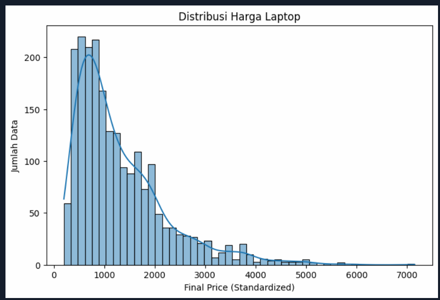
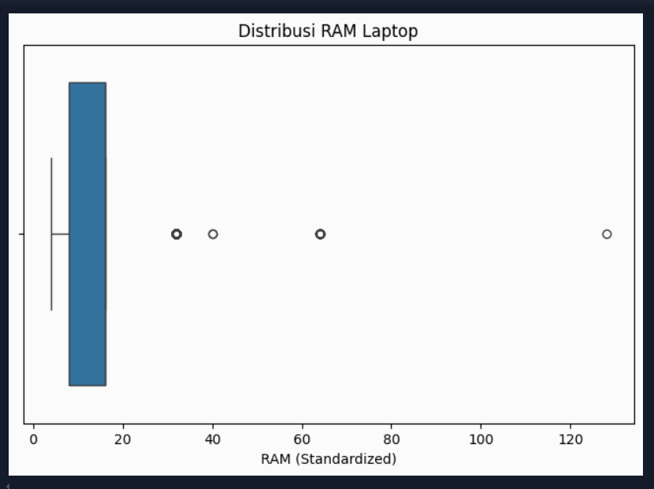
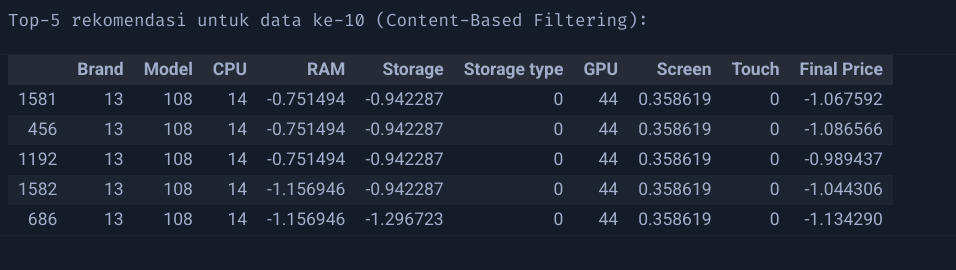

# Laporan Proyek Machine Learning - Arliyandi

## Project Overview

Laptop sudah hampir menjadi kebutuhan primer bagi masyarakat saat ini (Hill & Alexander, 2017). Pembelian perangkat laptop sering kali dihadapkan pada banyak pilihan spesifikasi, harga, dan brand. Calon pembeli kerap kesulitan dalam memilih laptop yang paling sesuai dengan kebutuhan spesifik maupun anggaran yang dimiliki (Loeffler, 2024). Oleh karena itu, pengembangan sistem rekomendasi berbasis spesifikasi produk dapat membantu mempermudah proses pengambilan keputusan pembelian laptop.

Source :
- Hill, N., & Alexander, J. (2017). The handbook of customer satisfaction and loyalty measurement (3rd Edition). Routledge.
- Loeffler, J. (2024). Chromebooks vs Laptops: which is best for students? Techradar.Com.

## Business Understanding

### Problem Statements

- Bagaimana membantu pengguna menemukan laptop yg sesuai dengan preferensi spesifikasi mereka?
- Bagaimana menyusun sistem rekomendasi laptop tanpa menggunakan data historis interaksi pengguna?

### Goals

- Membangun sistem rekomendasi berbasis content-based filtering yg menyarankan laptop serupa berdasarkan spesifikasi fitur.
- Memberikan output Top-N rekomendasi laptop secara akurat dan efisien.

### Solution statements
- Digunakan pendekatan **Content-Based Filtering** karena dataset hanya berisi fitur produk, tanpa interaksi pengguna.
- Penggunaan cosine similarity antara representasi fitur produk untuk menghitung kemiripan.

## Data Understanding
Dataset yg digunakan berasal dari https://www.kaggle.com/datasets/juanmerinobermejo/laptops-price-dataset . Dataset berisi 2160 baris data laptop, dengan 12 fitur utama:

- **Laptop**: Nama produk (tidak digunakan dalam modeling).
- **Status**: Status produk (New) - tidak digunakan.
- **Brand**: Merek laptop.
- **Model**: Model produk.
- **CPU**: Tipe prosesor.
- **RAM**: Kapasitas RAM (GB).
- **Storage**: Kapasitas penyimpanan (GB).
- **Storage type**: Jenis penyimpanan (SSD/HDD).
- **GPU**: Jenis kartu grafis.
- **Screen**: Ukuran layar (inch).
- **Touch**: Layar sentuh (Yes/No).
- **Final Price**: Harga akhir (USD).

### Kondisi Data:

- Missing value:
  - Storage type: 42 data
  - GPU: 1371 data
  - Screen: 4 data
- Harga laptop berkisar dari $201 hingga $7150.
- RAM bervariasi antara 4GB hingga 128GB.
- Ukuran layar didominasi pada 15.6 inch.

### Visualisasi (EDA)

Visualisasi sederhana dilakukan untuk melihat sebaran data:

- **Distribusi Harga:** mayoritas produk berada pada harga menengah, terdapat outlier harga sangat tinggi.

Jika gambar tidak muncul, [lihat di sini](https://drive.google.com/file/d/1_J_yEJ5cvRj7f9eEMX8ZJTPdkYc6dbNG/view?usp=sharing)

- **Distribusi RAM:** sebagian besar laptop berada pada rentang RAM standar (8GB - 16GB), dengan sedikit outlier di kapasitas RAM yang tinggi.

Jika gambar tidak muncul, [lihat di sini](https://drive.google.com/file/d/1RCs9avFWDgEGDx_JayJzLTRrJvvOiL_N/view?usp=sharing)

## Data Preparation
Beberapa tahapan preparation yg dilakukan:

1. **Menghapus Kolom yang tidak diperlukan**
   - Beberapa fitur seperti status dan laptop tidak relevan dengan fitur produk terutama pada model nantinya. jadi fitur tersebut dihapus.
2. **Handling Missing Value**
   - Storage type -> diisi dengan mode.
   - GPU -> diisi dengan string 'Unknown'
   - Screen -> diisi dengan median.

3. **Encoding Kategorikal**
   - Kolom: `Brand`, `Model`, `CPU`, `Storage type`, `GPU`, dan `Touch` diubah menggunakan Label Encoding

4. **Scaling Numerik**
   - Kolom numerik `RAM`, `Storage`, `Screen`, dan `Final Price` distandarisasi menggunakan StandardScaler untuk menyamakan skala perhitungan similarity.

## Modeling

Metode yang digunakan adalah **Content-Based Filtering** dengan perhitungan cosine similarity antar produk. Prosesnya:

- Menggabungkan seluruh fitur ke dalam satu matriks representasi (`features`).
- Menghitung cosine similarity antar laptop.
- Untuk setiap index data, sistem merekomendasikan Top-N (misalnya 5) laptop yang paling mirip (selain dirinya sendiri).

Jika gambar tidak muncul, [lihat di sini](https://drive.google.com/file/d/17hRHG-0SMnQDtjGRLnxrOBl2rwgHObqy/view?usp=sharing)

## Evaluation

Sistem menggunakan pendekatan **unsupervised Content-Based Filtering**, sehingga tidak memiliki data label eksplisit untuk relevansi item.

Oleh karena itu, digunakan metrik **Pseudo Precision@K** sebagai pendekatan evaluasi:

- Dihitung berdasarkan jumlah item yang memiliki cosine similarity ≥ 0.95 terhadap item referensi
- Untuk contoh pengguna index ke-10, **Pseudo Precision@5 = 1.0000** menunjukkan bahwa seluruh item rekomendasi sangat mirip.

Metrik seperti Precision@K, Recall@K, dan F1@K tidak digunakan karena dataset tidak mengandung ground truth berupa *user-item relevance label*.

**Evaluasi terhadap business goals:**
- Sistem berhasil membantu pengguna menemukan produk serupa, menjawab problem statement utama.
- Rekomendasi konsisten dan bisa diandalkan, cocok untuk pengguna yang mencari produk dengan spesifikasi yang familiar atau mirip.

**---Ini adalah bagian akhir laporan---**
